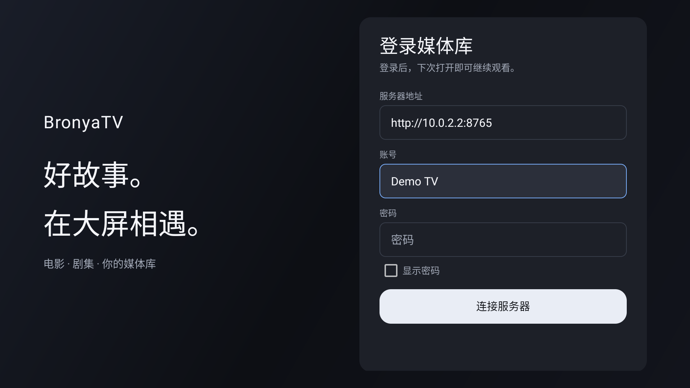
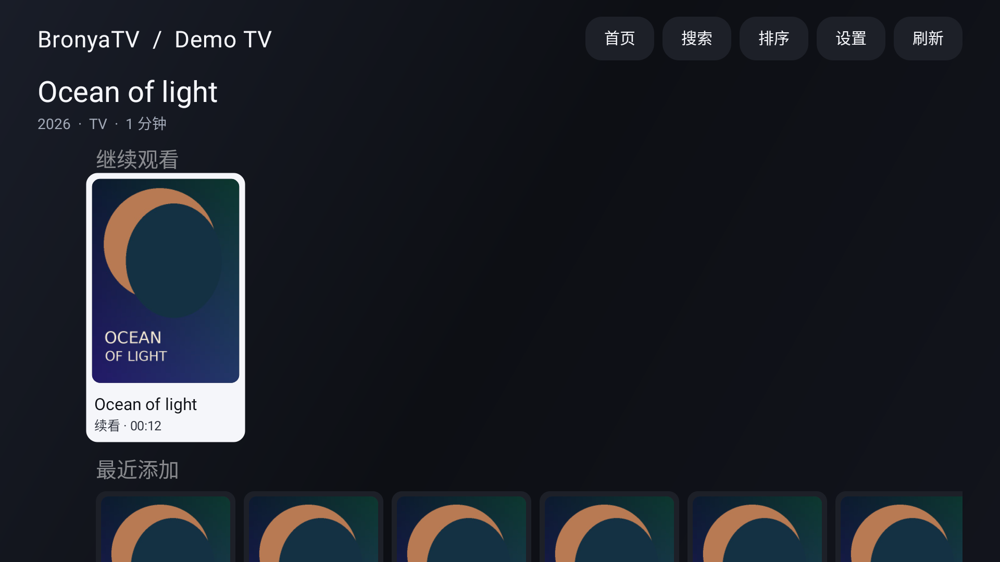
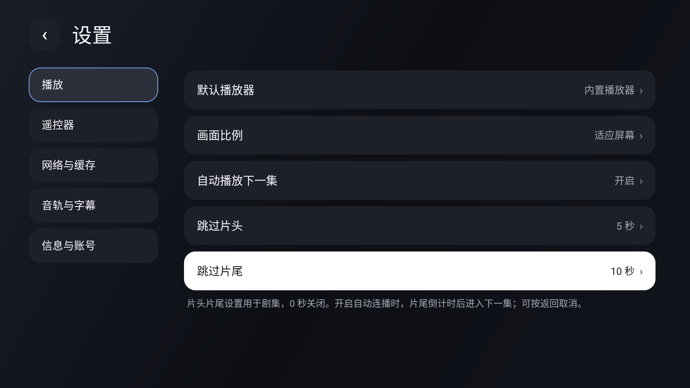
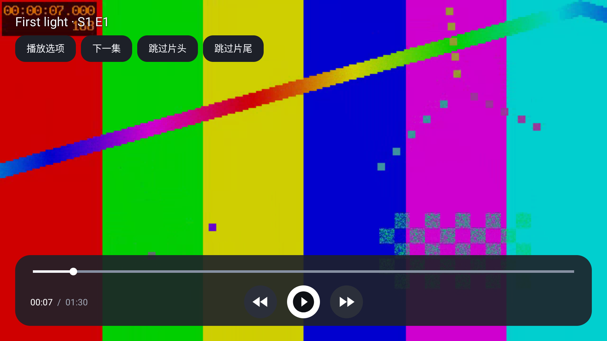

# BronyaTV

面向 Android TV 的 Emby 播放客户端。简洁暗色界面、圆角海报和清晰的遥控器焦点，让电影与剧集更适合大屏观看。支持 Android 6.0 及以上系统。

[下载 BronyaTV 1.2.1](https://github.com/dakaishizhong/BronyaTV/releases/download/v1.2.1/BronyaTV-1.2.1-release.apk) · [版本发布说明](https://github.com/dakaishizhong/BronyaTV/releases) · [构建与开发](docs/DEVELOPMENT.md)

## 功能

- 账号密码登录，加密保存会话，自动登录。
- 继续观看、最近添加、媒体分类、搜索、排序和分页浏览。
- 影片详情、海报、多片源选择，播放中切换片源并保留进度。
- 原始片源播放，支持 MP4、MKV、H.264、H.265，以及设备支持的 HDR / Dolby Vision。
- 音轨和字幕选择、内嵌与外置 SRT / ASS 字幕、字幕大小和语言偏好。
- 内置 TrueHD / MLP 软件音频解码，使用 PCM 兼容输出；此路径不提供 TrueHD Atmos 直通。
- 短按、长按快进与快退，步长分别可调；跳转预览、返回取消、指定时间跳转。
- 上一集、下一集、跨季连续播放；可调片头片尾秒数，片尾连播倒计时可取消。
- 播放速度、画面比例、默认播放器；支持调用已安装的 VLC、MX Player、Just Player。
- 自动或 2 / 4 / 8 路分段接收，预缓冲、回退缓存及内存缓存上限设置。
- 性能信息与播放诊断：实际解码分辨率、首帧、HDR / 杜比路径、系统音频输出、网络速度、帧率、丢帧和内存。

## 安装与登录

下载 APK 后在电视上安装。覆盖安装可保留登录和设置；也可使用 ADB：

```bash
adb install -r BronyaTV-1.2.1-release.apk
```

输入服务器地址、账号和密码。地址支持 HTTPS、自定义端口和反向代理路径，例如 `https://emby.example.com/emby`。省略协议时使用 HTTPS。登录成功后会自动保存加密会话，密码不保存。

## 遥控器与设置

方向键移动焦点，确定键打开内容或选择操作。播放时，菜单键或顶部“播放选项”可切换轨道、倍速、画面比例、字幕及片源。

控制栏隐藏时，左右短按预览跳转位置；长按按设定步长持续移动，松开后跳转，返回键取消。控制栏显示时，左右键用于选择按钮。快进、快退键也可直接使用。短按默认 10 秒，长按每次默认 30 秒，在“设置 → 遥控器”分别调整。

“设置 → 播放”可开启自动播放下一集，设置跳过片头、片尾的秒数（0–600 秒，0 为关闭）。跳过设置用于剧集；已超过片头的续播不会回退。片尾倒计时中按返回可取消跳过。

“设置 → 网络与缓存”提供分段接收、接收缓冲和播放缓存。默认自动选择连接数，网络接收缓冲默认系统自动，无需 root。缓存按需使用内存，实际用量由设备可用内存限制。

“播放选项 → 播放诊断详情”可查看、刷新和复制诊断信息。片源声明、实际解码画面、Surface 和显示模式分别展示；HDR / Dolby Vision 解码路径与系统音频码流按实际观察显示。电视屏幕或音响的最终 HDR / Atmos 模式无法由系统可靠确认时，会显示“未确认”。

## 界面

| 登录 | 首页 |
| --- | --- |
|  |  |

| 设置 | 播放 |
| --- | --- |
|  |  |

## 开发

Kotlin、Leanback、AndroidX Media3；使用原生电视视图、列表复用和有界内存缓存。开发、构建与测试步骤见 [开发说明](docs/DEVELOPMENT.md)，每个版本的改动和验证见 [发布说明](https://github.com/dakaishizhong/BronyaTV/releases)。

采用 [GPL-3.0](LICENSE) 许可证。
