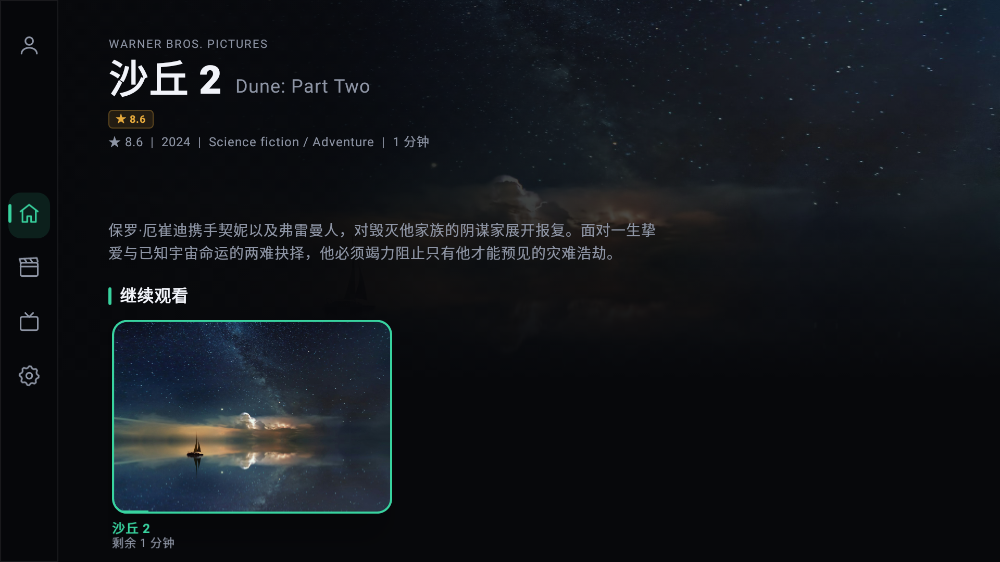
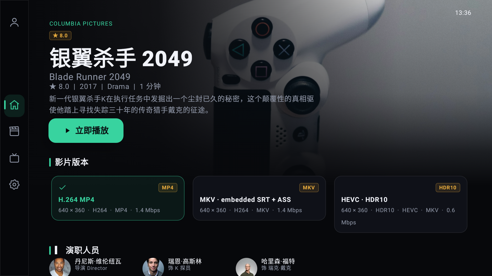
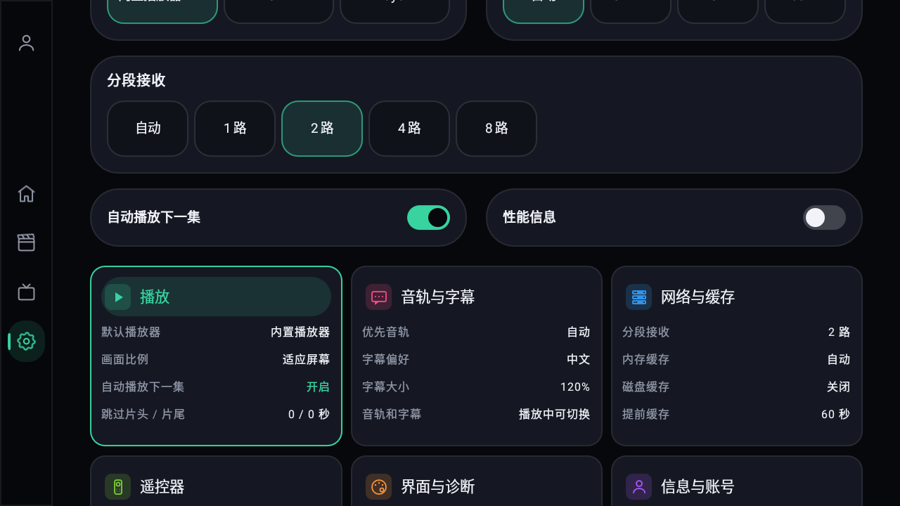
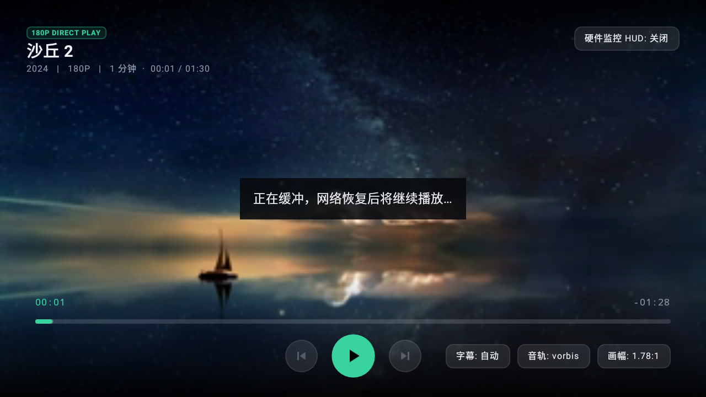
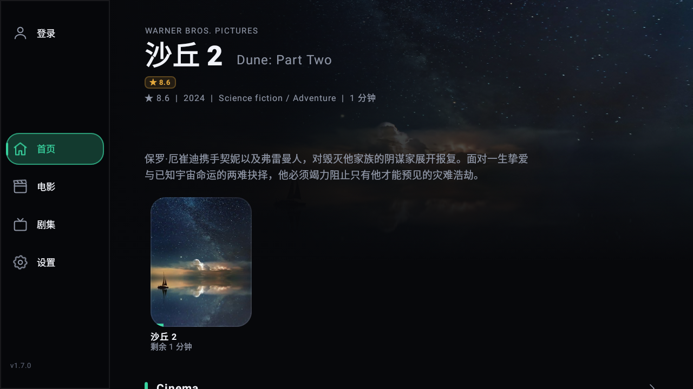
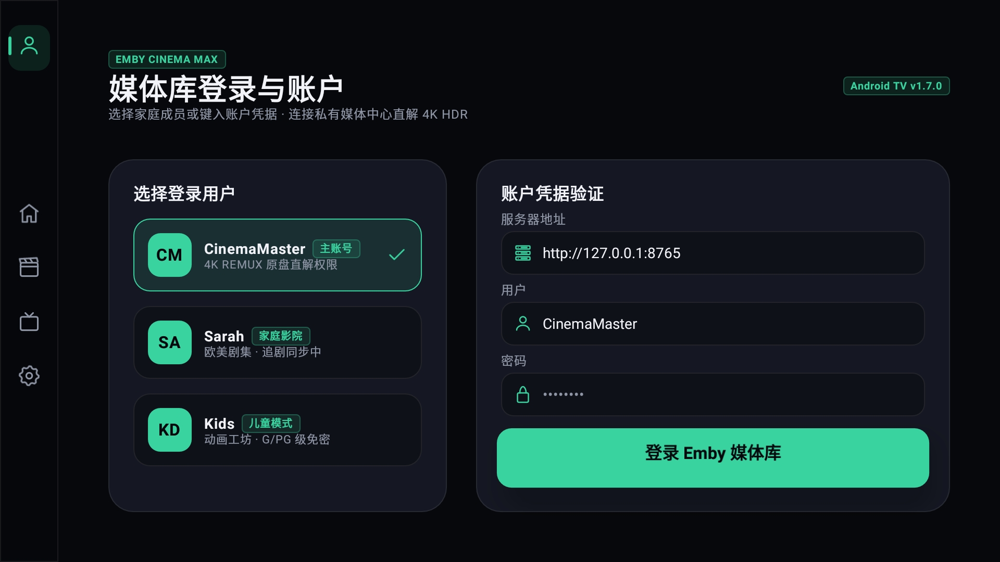
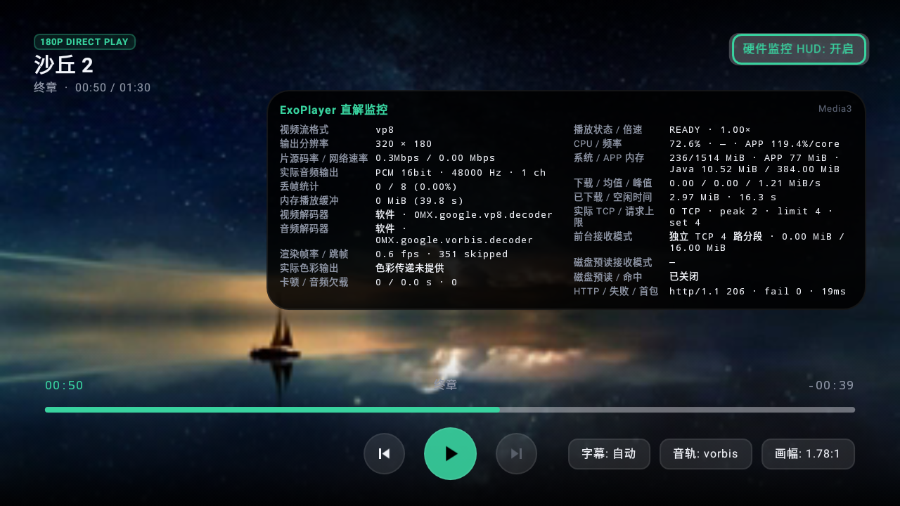
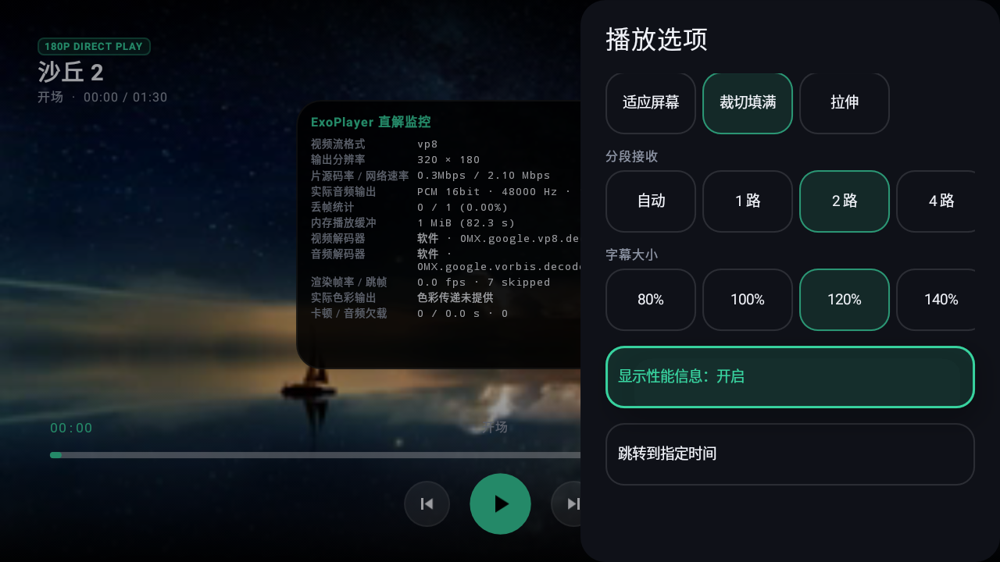

# BronyaTV

**English** | [简体中文](README.zh-CN.md)

An Emby playback client for Android TV. Dark movie backdrops, green remote focus indicators, expanding cards and a collapsible sidebar bring your movies and series to the big screen. Supports Android 6.0 and later, with English and Simplified Chinese interfaces.

[Latest APK: 1.7.4](https://github.com/dakaishizhong/BronyaTV/releases/download/v1.7.4/BronyaTV-1.7.4-release.apk) · [Release notes](https://github.com/dakaishizhong/BronyaTV/releases) · [Build and development guide (Chinese)](docs/DEVELOPMENT.md)

Version 1.7.4 includes the range-pipeline improvements described below and uses a new signing key. See the upgrade instructions before installing.

## Features

- Username and password login, encrypted session storage, and automatic login.
- English by default, with a saved English / Simplified Chinese language preference.
- Continue watching first, followed by the first six actual Emby libraries in server order. Library headings open their original folder structure directly. Additional libraries stay accessible below. No regional categories or counts are invented.
- Movies / series show content first and direct server-library tabs. Optional **Filter & sort** reveals compact genre, year, watch status and sort selectors. Filtering and pagination run on the server; available facets come from Emby. Search starts after a 300 ms typing pause; remote/IME submission is immediate. Full-width input and whitespace are normalized, obsolete requests are cancelled, and default ordering comes from the server. Recent queries remain available.
- Home and related-title cards expand on focus and update the backdrop and title metadata. Category and search cards retain their fixed grid layout. The sidebar takes up layout space when expanded.
- Server-provided movie backdrops, quality badges based on actual media metadata, resume progress, cast and crew, related titles, and a six-panel settings overview.
- Select the server-provided version directly in details, then play or resume it. Resolution, HDR, codec and bitrate come from the server. Source switching during playback preserves progress; playback URLs are freshly negotiated.
- Bounded image disk cache for posters, backdrops and people, with capacity, usage and clear controls. Separate persistent descriptive metadata loads first while the server refreshes it.
- Original-source playback for MP4, MKV, H.264, and H.265, including HDR / Dolby Vision supported by the device.
- Audio and subtitle selection, embedded and external SRT / ASS subtitles, subtitle size, and language preferences.
- TrueHD / MLP / DTS / DTS-HD: prefer device MediaCodec/vendor decoding to PCM, with built-in FFmpeg fallback for unsupported devices or decoder failures. PCM output does not retain TrueHD Atmos or DTS:X object metadata.
- Configurable short-press and long-press seeking, seek preview, Back to cancel, and jumping to a specific time.
- Previous / next episode, continuous playback across seasons, configurable intro / outro skipping, and a cancelable next-episode countdown.
- Playback speed, aspect ratio, default player, and support for installed VLC, MX Player, and Just Player apps.
- Automatic or 1 / 2 / 4 / 8 stream connections, with improved sustained fetching for high-bitrate original files.
- Configurable disk read-ahead cache, cache reuse when seeking, and immediate network fallback on cache misses.
- Performance overlay and playback diagnostics: decoded resolution, first frame, HDR / Dolby path, system audio output, network speed, frame rate, dropped frames, and memory.

## Installation and login

1.7.4 uses a new signing key. Uninstall any earlier version before installing 1.7.4, then sign in again. Uninstalling removes the old application's local login, settings and cache. Future releases using the 1.7.4 key can update this version directly. After uninstalling the earlier version, you can also install with ADB:

```bash
adb install -r BronyaTV-1.7.4-release.apk
```

Enter your server URL, username, and password. HTTPS, custom ports, and reverse proxy paths are supported, for example `https://emby.example.com/emby`. URLs without a scheme use HTTPS. After a successful login, the encrypted session is saved; the password is not stored.

Press OK on a focused input field to open the keyboard. While it is open, direction keys select keyboard keys and OK enters the selected character. Back closes the keyboard and restores page navigation.

## Remote control and settings

Choose a version in **Details → Video versions**, then select Play or Resume. The app revalidates that source at activation time. A removed version shows an error so you can select another. External players and the in-player source menu remain available.

Use **Settings → Interface & diagnostics → Interface language** to switch between English and Simplified Chinese. The choice persists across restarts; server-provided titles and descriptions keep their original language. Sign-in shows public user profiles, server / username / password fields, and the sign-in action.

Use direction buttons to move focus and OK to open content or choose an action. Press Menu for refresh, filtering, search and favorites. Home and category pages have no top-right action buttons. The player has previous chapter / episode, Play/Pause and next chapter / episode circles, with subtitle, audio and aspect buttons on the right. Play/Pause stays at the horizontal screen center. Up reaches the timeline and then the HUD toggle; Down returns to Play/Pause. Aspect cycles directly on click. Playback Menu puts track, speed, aspect, subtitle size and parallel receive choices in one panel. There is no exit button; use remote Back. The HUD shows live decoder, CPU/RAM, network, configured connections, active TCP and HTTP ranges, ready bytes, loading demand, cache hits and cancellation measurements. Pages use the remote Back key.

When the control bar is hidden, briefly press Left / Right to preview a seek position. Hold a direction button to advance by the configured long-press step, then release to seek. Press Back to cancel. When the bar is visible, Left / Right selects controls. Fast-forward and rewind buttons are also supported. The defaults are 10 seconds for a short press and 30 seconds per long-press step; adjust them under **Settings → Remote control**.

Under **Settings → Playback**, enable automatic next-episode playback and set intro / outro skip durations from 0 to 600 seconds; 0 disables skipping. These settings apply to episodes. Resuming past the intro does not move playback backward. Press Back during the outro countdown to cancel skipping.

**Settings → Network & cache** controls parallel connections, receive buffers, memory cache limits, and disk cache without root access. Connection count and network receive buffers default to automatic. High-bitrate automatic buffering targets up to 128 MiB, typically 64–128 MiB when heap headroom allows. Smaller heaps and memory pressure reduce the budget. Startup and rebuffering use Media3 load control; the short recovery threshold applies only to seeks.

Disk cache defaults to automatic capacity, up to 512 MiB, with 60 seconds of read-ahead. It can be disabled or set to 256 MiB–8 GiB, with 15 seconds–5 minutes of read-ahead. Read-ahead is estimated from the source bitrate and uses at most three quarters of capacity. Capacity shrinks with available storage, reserving 256 MiB; older data is evicted when full. Changes take effect when a video is reopened. Clearing disk cache removes playback cache only.

Disk read-ahead applies to original-file playback such as MP4 and MKV. HLS / DASH uses the player's buffer. Cache lives in private application storage and requires no storage permission. Backward playback and seeking within the current player can reuse cached data. Switching sources, rebuilding the player, or reopening a title uses a new cache identifier to avoid mixing expired links or different files. This is temporary playback cache, not offline downloading.

Buffering adapts to device memory. Once playback has enough buffered data, zero active stream requests can be normal.

**Image cache** defaults to 256 MiB of private disk storage and can be disabled or set to 64–1024 MiB. Images are requested and decoded for their displayed dimensions; the URL includes the server ImageTag. Identical requests share work, with at most three image loads. Different display sizes of the same image URL reuse its encoded disk data. Stopped pages release their bitmap references and cancel outstanding loads. Decoded memory is capped at 2–12 MiB according to heap size and drops to at most 3 MiB during playback or 2 MiB under memory pressure. Clear image cache affects only these images.

Title, overview, cast and descriptive version metadata use a separate 24 MiB persistent cache. Both caches are isolated by server and user. Metadata appears immediately from cache and refreshes in the background. A page revisited within 15 seconds reuses its in-memory response while applying fresh local playback progress; explicit Refresh always contacts the server. Genre/year facets load only when Filter & sort is opened. Browse/search card responses omit unnecessary full descriptions and cast lists; details still fetch these fields. Playback progress remains live; temporary URLs, authentication headers and playback sessions are excluded from persistent metadata. Playback buffers and read-ahead are separate.

**Playback options → Playback diagnostics** lets you view, refresh, and copy diagnostics. Source declarations, decoded video, Surface, and display mode are listed separately, alongside disk read-ahead, cache usage, cache hits, and recent audio, video, or network failures. HDR / Dolby Vision decoder paths and system audio bitstreams reflect observed output. Final HDR / Atmos modes on the TV or sound system appear as **Unconfirmed** when Android cannot reliably identify them.

## Screenshots

Player and settings screenshots show 1.7.2; Home, details, sidebar and login retain the Cinema UI baseline captures. Demo images and users are fictional examples; see [example resources](tests/media/CINEMA-REFERENCE.md). Test video is generated from the reference images. Production pages use the connected Emby server's data.

| Home | Details |
| --- | --- |
|  |  |

| Settings | Playback |
| --- | --- |
|  |  |

| Expanded sidebar | Sign in |
| --- | --- |
|  |  |

| Playback HUD | Direct playback options |
| --- | --- |
|  |  |

## Development

All application pages, sidebar navigation, settings editors, playback controls and dialog content use Kotlin and Compose for TV / TV Material. Media3 playback and decoding remain intact; PlayerView interoperability supplies the video Surface and subtitles. Lazy lists use stable item keys and restore remote focus and scroll positions. See the [development guide (Chinese)](docs/DEVELOPMENT.md) for build and test instructions and [releases](https://github.com/dakaishizhong/BronyaTV/releases) for changes and validation.

Licensed under [GPL-3.0](LICENSE).
