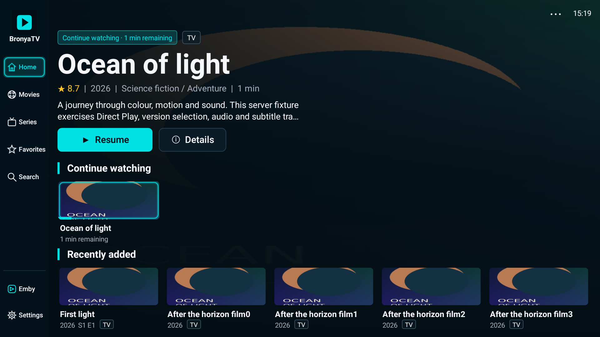
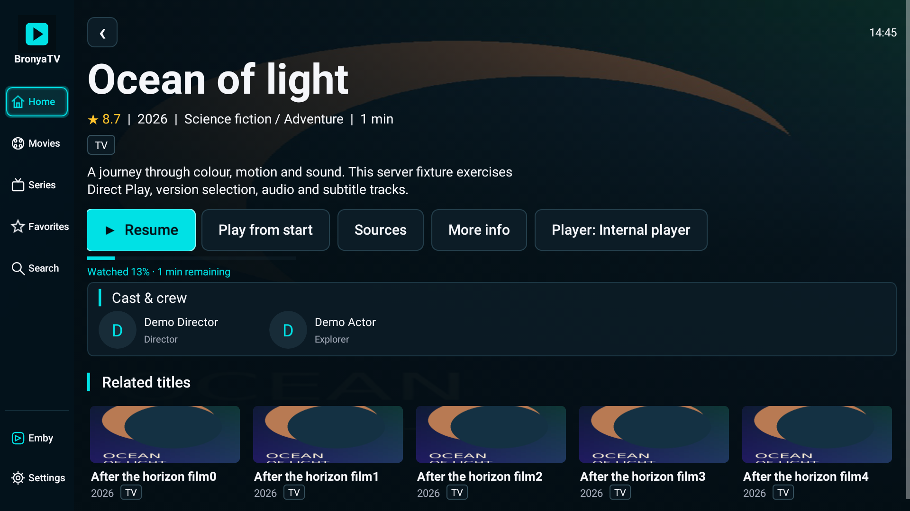
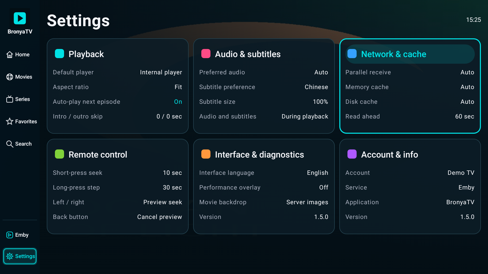
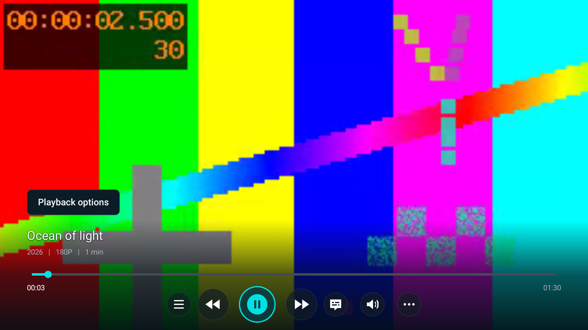
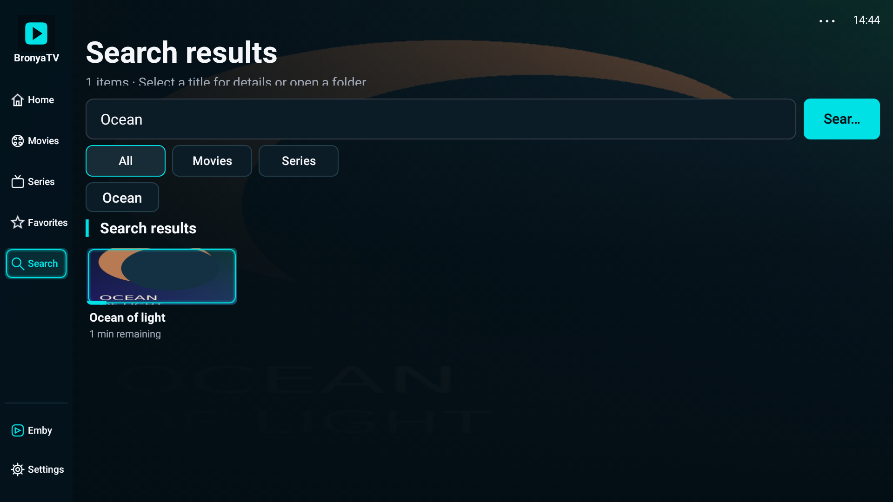

# BronyaTV

**English** | [简体中文](README.zh-CN.md)

An Emby playback client for Android TV. Dark movie backdrops, cyan remote focus indicators, and landscape media cards bring your movies and series to the big screen. Supports Android 6.0 and later, with English and Simplified Chinese interfaces.

[Download BronyaTV 1.5.0](https://github.com/dakaishizhong/BronyaTV/releases/download/v1.5.0/BronyaTV-1.5.0-release.apk) · [Release notes](https://github.com/dakaishizhong/BronyaTV/releases) · [Build and development guide (Chinese)](docs/DEVELOPMENT.md)

## Features

- Username and password login, encrypted session storage, and automatic login.
- English by default, with a saved English / Simplified Chinese language preference.
- Continue watching, recently added media, movie / series / favorites navigation, library folders, inline search, recent queries, type filters, sorting, and pagination.
- Server-provided movie backdrops, quality badges based on actual media metadata, resume progress, cast and crew, related titles, and a six-panel settings overview.
- Movie details, posters, multiple source selection, and source switching during playback with progress preserved.
- Original-source playback for MP4, MKV, H.264, and H.265, including HDR / Dolby Vision supported by the device.
- Audio and subtitle selection, embedded and external SRT / ASS subtitles, subtitle size, and language preferences.
- TrueHD / MLP / DTS / DTS-HD: prefer device MediaCodec/vendor decoding to PCM, with built-in FFmpeg fallback for unsupported devices or decoder failures. PCM output does not retain TrueHD Atmos or DTS:X object metadata.
- Configurable short-press and long-press seeking, seek preview, Back to cancel, and jumping to a specific time.
- Previous / next episode, continuous playback across seasons, configurable intro / outro skipping, and a cancelable next-episode countdown.
- Playback speed, aspect ratio, default player, and support for installed VLC, MX Player, and Just Player apps.
- Automatic or 2 / 4 / 8 total stream connections shared by playback and disk read-ahead. Playback gets priority; ranges stream in order with bounded, reusable buffers.
- Configurable disk read-ahead cache, immediate network fallback for unready cache spans, cache clearing, and usage diagnostics.
- Performance overlay and playback diagnostics: decoded resolution, first frame, HDR / Dolby path, system audio output, network speed, frame rate, dropped frames, and memory.

## Installation and login

Version 1.4.0 uses a new signing key. When moving from 1.3.0 or earlier, uninstall the old version, install the new APK, and sign in again. Old application data will not be retained. Later releases using the 1.4.0 key can update this installation. You can also install with ADB:

```bash
adb install -r BronyaTV-1.5.0-release.apk
```

Enter your server URL, username, and password. HTTPS, custom ports, and reverse proxy paths are supported, for example `https://emby.example.com/emby`. URLs without a scheme use HTTPS. After a successful login, the encrypted session is saved; the password is not stored.

## Remote control and settings

Use **Settings → Interface & diagnostics → Interface language** to switch between English and Simplified Chinese. You can also choose **Language** on the sign-in screen. The choice persists across restarts; server-provided titles and descriptions keep their original language.

Use the direction buttons to move focus and OK to open content or choose an action. In the browser, press Menu or select **⋯** to access sorting and refresh. During playback, the Menu button or **Playback options** opens audio, subtitle, speed, aspect ratio, and source controls. The bottom control bar also provides source, subtitle, and audio shortcuts.

When the control bar is hidden, briefly press Left / Right to preview a seek position. Hold a direction button to advance by the configured long-press step, then release to seek. Press Back to cancel. When the bar is visible, Left / Right selects controls. Fast-forward and rewind buttons are also supported. The defaults are 10 seconds for a short press and 30 seconds per long-press step; adjust them under **Settings → Remote control**.

Under **Settings → Playback**, enable automatic next-episode playback and set intro / outro skip durations from 0 to 600 seconds; 0 disables skipping. These settings apply to episodes. Resuming past the intro does not move playback backward. Press Back during the outro countdown to cancel skipping.

**Settings → Network & cache** controls parallel connections, receive buffers, memory cache limits, and disk cache without root access. Connection count and network receive buffers default to automatic. High-bitrate automatic buffering targets up to 128 MiB, typically 64–128 MiB when heap headroom allows. Smaller heaps and memory pressure reduce the budget. Startup and rebuffering use Media3 load control; the short recovery threshold applies only to seeks.

Disk cache defaults to automatic capacity, up to 512 MiB, with 60 seconds of read-ahead. It can be disabled or set to 256 MiB–8 GiB, with 15 seconds–5 minutes of read-ahead. Read-ahead is estimated from the source bitrate and uses at most three quarters of capacity. Capacity shrinks with available storage, reserving 256 MiB; older data is evicted when full. Changes take effect when a video is reopened. Clearing disk cache removes playback cache only.

Disk read-ahead applies to original-file playback such as MP4 and MKV. HLS / DASH uses the player's buffer. Cache lives in private application storage and requires no storage permission. Backward playback and seeking within the current player can reuse cached data. Switching sources, rebuilding the player, or reopening a title uses a new cache identifier to avoid mixing expired links or different files. This is temporary playback cache, not offline downloading.

**Playback options → Playback diagnostics** lets you view, refresh, and copy diagnostics. Source declarations, decoded video, Surface, and display mode are listed separately, alongside disk read-ahead, cache usage, cache hits, and recent audio, video, or network failures. HDR / Dolby Vision decoder paths and system audio bitstreams reflect observed output. Final HDR / Atmos modes on the TV or sound system appear as **Unconfirmed** when Android cannot reliably identify them.

## Screenshots

These screenshots show version 1.5.0 with a mock Emby server. Movies and metadata are test fixtures.

| Home | Details |
| --- | --- |
|  |  |

| Settings | Playback |
| --- | --- |
|  |  |



## Development

Built with Kotlin, Compose for TV / TV Material, Leanback, and AndroidX Media3. The settings dashboard uses Compose with DPAD navigation; category editors, browsing, and the player retain their existing implementation during incremental migration. See the [development guide (Chinese)](docs/DEVELOPMENT.md) for build and test instructions and [releases](https://github.com/dakaishizhong/BronyaTV/releases) for changes and validation.

Licensed under [GPL-3.0](LICENSE).
