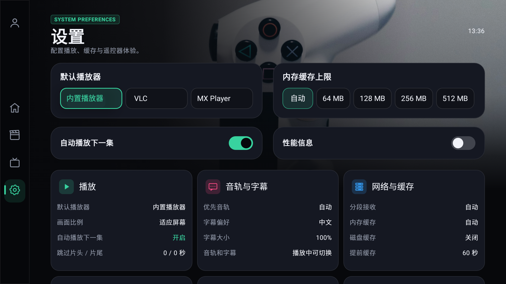
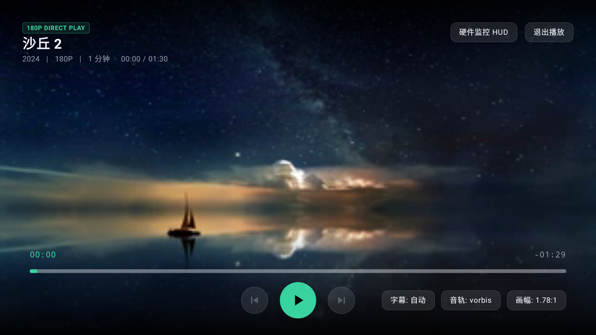

# BronyaTV

**中文** | [English](README.md)

面向 Android TV 的 Emby 播放客户端。深色影片背景、翠绿遥控器焦点、获焦展开卡片和可折叠侧栏，让电影与剧集更适合大屏观看。支持 Android 6.0 及以上系统。

[最新 APK：1.7.1](https://github.com/dakaishizhong/BronyaTV/releases/download/v1.7.1/BronyaTV-1.7.1-release.apk) · [版本发布说明](https://github.com/dakaishizhong/BronyaTV/releases) · [构建与开发](docs/DEVELOPMENT.md)

## 功能

- 账号密码登录，加密保存会话，自动登录。
- 默认英文界面，支持切换为简体中文并保存语言选择。
- 首页先展示最近播放与继续观看，下方按 Emby 顺序展示前六个真实媒体库分区，分区标题可直接进入原有目录；其余媒体库保留入口，不编造地区分类或数量。
- 电影和剧集页优先展示影片与直接媒体库入口，按需展开“筛选与排序”，类型、年份、观看状态和排序由服务器执行；保留目录、收藏、搜索和历史。搜索输入停顿 300 毫秒后自动更新，确认键立即提交；统一全角字符与空白，取消过期请求，默认采用服务器搜索排序。
- 首页与相关推荐卡片获焦时展开，同步更新背景及影片元数据；分类与搜索保留固定网格。侧栏展开时占用实际布局宽度。
- 服务器影片背景、真实画质标签、续看进度、演职人员、相关推荐及六块设置面板。
- 详情页直接选择服务器提供的影片版本，显示实际分辨率、HDR、编码与码率；点击播放时重新协商地址。保留续播、外部播放器和播放中换源。
- 图片磁盘缓存提供容量、已用空间与清理；元数据单独持久缓存，优先展示缓存并后台更新。
- 原始片源播放，支持 MP4、MKV、H.264、H.265，以及设备支持的 HDR / Dolby Vision。
- 音轨和字幕选择、内嵌与外置 SRT / ASS 字幕、字幕大小和语言偏好。
- TrueHD / MLP / DTS / DTS-HD 优先设备 MediaCodec / 厂商解码器输出 PCM；设备不支持或解码失败时回退内置 FFmpeg。PCM 输出不保留 TrueHD Atmos 或 DTS:X 对象元数据。
- 短按、长按快进与快退，步长分别可调；跳转预览、返回取消、指定时间跳转。
- 上一集、下一集、跨季连续播放；可调片头片尾秒数，片尾连播倒计时可取消。
- 播放速度、画面比例、默认播放器；支持调用已安装的 VLC、MX Player、Just Player。
- 自动或 2 / 4 / 8 路取流总并发由前台和磁盘预取共享，播放优先；分片按顺序边接收边输出，复用有界缓冲。
- 可调容量的磁盘提前缓存；缓存未就绪时立即走网络，支持清理和缓存占用诊断。
- 性能信息与播放诊断：实际解码分辨率、首帧、HDR / 杜比路径、系统音频输出、网络速度、帧率、丢帧和内存。

## 安装与登录

1.7.1 使用新的签名密钥。从 1.7.0 或更早版本迁移时，需要先卸载旧版，再安装 1.7.1 并重新登录；卸载会删除旧版应用数据。后续沿用此新密钥的版本可覆盖升级。卸载旧版后也可使用 ADB 安装：

```bash
adb install BronyaTV-1.7.1-release.apk
```

输入服务器地址、账号和密码。地址支持 HTTPS、自定义端口和反向代理路径，例如 `https://emby.example.com/emby`。省略协议时使用 HTTPS。登录成功后会自动保存加密会话，密码不保存。

## 遥控器与设置

分类页优先展示影片，点击服务器媒体库入口直接进入内容。遥控器菜单键提供刷新、筛选、搜索和收藏入口；主页和分类页右上角没有操作按钮。

在“详情 → 影片版本”选择服务器提供的版本，再点击播放或继续播放。播放时重新获取有效地址；版本已被移除时提示重新选择。

在“Settings → Interface & diagnostics → Interface language”选择“简体中文”；中文界面的入口是“设置 → 界面与诊断 → 界面语言”。重启后保留选择，服务器影片名称和简介保持原文。登录页展示公开用户卡片、服务器/用户/密码输入框及登录按钮。

方向键移动焦点，确定键打开内容或选择操作。播放器使用上一章节/集、播放/暂停、下一章节/集三个圆形按钮，右侧为字幕、音轨、画幅按钮；播放/暂停位于屏幕横向中心。向上进入进度条，再向上进入 HUD/退出播放按钮，向下返回播放/暂停。遥控器菜单键打开其余播放选项。页面使用遥控器返回键。

控制栏隐藏时，左右短按预览跳转位置；长按按设定步长持续移动，松开后跳转，返回键取消。控制栏显示时，左右键用于选择按钮。快进、快退键也可直接使用。短按默认 10 秒，长按每次默认 30 秒，在“设置 → 遥控器”分别调整。

“设置 → 播放”可开启自动播放下一集，设置跳过片头、片尾的秒数（0–600 秒，0 为关闭）。跳过设置用于剧集；已超过片头的续播不会回退。片尾倒计时中按返回可取消跳过。

“设置 → 网络与缓存”提供分段接收、接收缓冲、内存缓存上限和磁盘缓存，无需 root。默认自动选择连接数，网络接收缓冲默认系统自动；内存用量受设备可用内存限制。

磁盘缓存默认自动容量（最多 512 MiB），提前缓存默认 60 秒；可关闭，或选择 256 MiB 至 8 GiB，以及 15 秒至 5 分钟的提前量。提前量根据片源码率估算，最多使用容量的四分之三。容量会根据剩余空间缩减，预留 256 MiB；容量满后淘汰较旧的数据。设置在重新打开视频后生效，“清空磁盘缓存”只删除播放缓存。

磁盘提前缓存用于 MP4、MKV 等原文件播放；HLS / DASH 使用播放器缓冲。缓存保存在应用私有存储，不需要存储权限。当前播放器内的回退和跳转可复用已缓存的数据；切换片源、重建播放器或重新打开影片使用新的缓存标识，避免混用失效链接或不同版本的文件。这是临时播放缓存，不是离线下载。

“图片缓存”默认占用最多 256 MiB 磁盘，可关闭或设为 64–1024 MiB。海报、背景和人物图片按显示尺寸请求并解码，使用服务器 ImageTag 更新；相同请求合并，最多同时加载三张图片；同一图片 URL 的不同显示尺寸共用一份磁盘数据。页面停止后释放图片引用并取消未完成的加载。解码图片内存根据堆大小限制在 2–12 MiB，播放中最多 3 MiB，内存紧张时最多 2 MiB。清理只影响图片。

标题、简介、演职人员和版本描述使用独立的 24 MiB 元数据持久缓存，先展示缓存再后台更新。15 秒内返回页面复用内存数据并应用最新本地播放进度；主动刷新始终请求服务器。类型与年份仅在展开筛选时获取，列表省去不需要的完整简介和演职人员字段。两类缓存按服务器与用户隔离。播放进度及时同步，临时播放地址、鉴权头和播放会话不写入元数据缓存；播放缓冲与磁盘预取独立。

“播放选项 → 播放诊断详情”可查看、刷新和复制诊断信息。片源声明、实际解码画面、Surface 和显示模式分别展示，并显示磁盘前向缓存、占用、命中读取和最近故障的音频、视频或取流分类；HDR / Dolby Vision 解码路径与系统音频码流按实际观察显示。电视屏幕或音响的最终 HDR / Atmos 模式无法由系统可靠确认时，会显示“未确认”。

## 界面

以下为基于 1.7.0 完成 Cinema UI、尚未递增 1.7.1 版本号时的实际模拟器截图。示例图片与用户使用设计文档中的资源，见 [示例资源说明](tests/media/CINEMA-REFERENCE.md)；测试视频由参考图片生成。生产页面使用所连接 Emby 服务器的数据。

| 首页 | 详情 |
| --- | --- |
|  |  |

| 设置 | 播放 |
| --- | --- |
|  |  |

| 展开侧栏 | 登录 |
| --- | --- |
|  |  |

## 开发

所有应用页面、侧栏、设置编辑页、播放控制和弹窗内容已迁移为 Kotlin + Compose for TV / TV Material；保留 Media3 播放与解码核心，PlayerView 承载视频 Surface 和字幕。惰性列表使用稳定 key，保存遥控器焦点与滚动位置。开发、构建与测试步骤见 [开发说明](docs/DEVELOPMENT.md)，每个版本的改动和验证见 [发布说明](https://github.com/dakaishizhong/BronyaTV/releases)。

采用 [GPL-3.0](LICENSE) 许可证。
